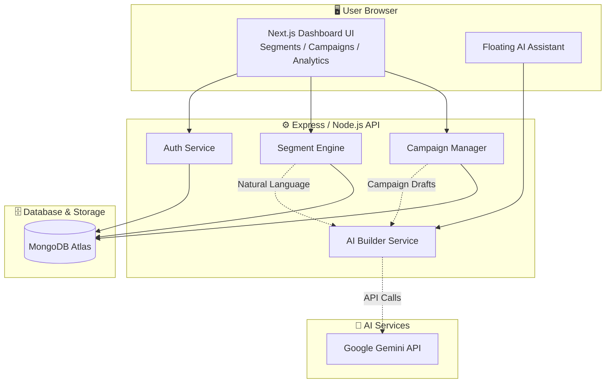

<div align="center">

# 🚀 CampaignCRM

**Your All-In-One Intelligent Customer Relationship & Outreach Platform**

[](https://nextjs.org/)
[](https://nodejs.org/)
[](https://www.mongodb.com/)
[](https://tailwindcss.com/)
[](https://opensource.org/licenses/MIT)

*An elegant, AI-driven CRM that helps you manage clients, generate smart segments, and run targeted email campaigns effortlessly.*

---

</div>

## ✨ Features

- 🧠 **AI-Powered Insights:** Integrated with Google Gemini to automatically generate campaigns, analyze customer sentiment, and segment your audience.
- 👥 **Smart Client Management:** A centralized hub to track every interaction, manage leads, and view deep customer analytics.
- 🎯 **Dynamic Segmentation:** Filter and group your audience using natural language or complex data attributes for highly targeted outreach.
- 📧 **Automated Email Campaigns:** Built-in SMTP integration to draft, schedule, and send beautiful emails directly from your dashboard.
- 📊 **Rich Analytics Dashboard:** Visualize your growth with real-time metrics, campaign open rates, and engagement tracking.
- 🔒 **Enterprise-Grade Security:** Fully protected with JWT-based authentication and secure role management.

## 🛠️ Tech Stack

### Frontend
- **Framework:** Next.js (React)
- **Styling:** Tailwind CSS + Radix UI
- **Language:** TypeScript
- **State Management:** Zustand / React Context

### Backend
- **Runtime:** Node.js
- **Framework:** Express.js
- **Database:** MongoDB (with Mongoose ODM)
- **AI Integration:** Google Gemini API
- **Email Service:** Nodemailer (SMTP)

## 🏗️ Architecture Overview



## 🚀 Getting Started

Follow these instructions to get the project up and running on your local machine.

### Prerequisites

Make sure you have the following installed:
- [Node.js](https://nodejs.org/) (v18 or higher)
- [Git](https://git-scm.com/)
- A MongoDB cluster (e.g., [MongoDB Atlas](https://www.mongodb.com/cloud/atlas))
- An SMTP account (like Gmail with App Passwords)
- Google Gemini API Key

### 1. Clone the repository

```bash
git clone https://github.com/aryanitt/CampaignCRM.git
cd CampaignCRM
```

### 2. Backend Setup

Open a terminal and navigate to the backend directory:

```bash
cd backend
npm install
```

Create a `.env` file in the root of the `backend` directory:
```env
PORT=4000
NODE_ENV=development
MONGO_URI=your_mongodb_connection_string
JWT_SECRET=your_super_secret_key
GEMINI_API_KEY=your_gemini_api_key
FRONTEND_URL=http://localhost:3000
BACKEND_URL=http://localhost:4000
SMTP_HOST=smtp.gmail.com
SMTP_PORT=587
SMTP_USER=your_email@gmail.com
SMTP_PASS=your_app_password
```

Start the backend development server:
```bash
npm run dev
```

### 3. Frontend Setup

Open a new terminal and navigate to the frontend directory:

```bash
cd frontend
npm install
```

Start the frontend Next.js application:
```bash
npm run dev
```

Your app should now be running! 
- **Frontend:** [http://localhost:3000](http://localhost:3000)
- **Backend API:** [http://localhost:4000](http://localhost:4000)

## 📁 Project Structure

```text
CampaignCRM/
├── backend/                  # Node.js/Express Backend
│   ├── src/
│   │   ├── controllers/      # API logic
│   │   ├── models/           # Mongoose schemas (Campaign, Segment, User)
│   │   ├── routes/           # Express endpoints
│   │   ├── services/         # AI & Email business logic
│   │   └── config/           # DB & Environment configs
│   └── package.json
└── frontend/                 # Next.js Frontend
    ├── app/                  # App Router pages (Dashboard, Auth, etc.)
    ├── components/           # Reusable UI components (Tailwind)
    ├── lib/                  # Utilities & Helpers
    ├── store/                # State management
    └── package.json
```

## 🤝 Contributing

Contributions are what make the open source community such an amazing place to learn, inspire, and create. Any contributions you make are **greatly appreciated**.

1. Fork the Project
2. Create your Feature Branch (`git checkout -b feature/AmazingFeature`)
3. Commit your Changes (`git commit -m 'Add some AmazingFeature'`)
4. Push to the Branch (`git push origin feature/AmazingFeature`)
5. Open a Pull Request

## 📄 License

Distributed under the MIT License. See `LICENSE` for more information.
